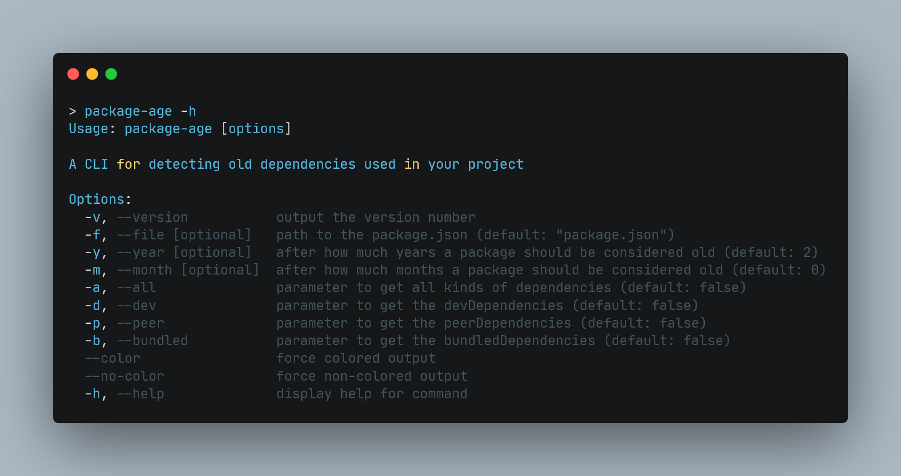

# package-age  [](https://www.npmjs.com/package/package-age) [](https://coveralls.io/github/ENT8R/package-age?branch=main)


> A CLI for detecting old dependencies used in your project

## Install

```
$ npm install package-age --global
```

## Usage



## License

GPL-3.0 © [ENT8R](https://github.com/ENT8R)
