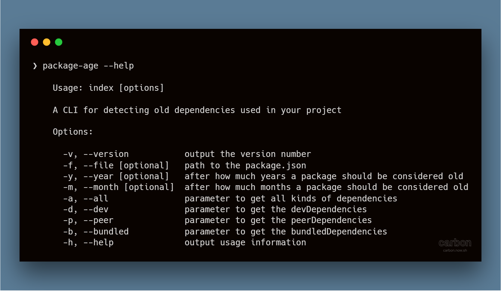

# package-age [](https://travis-ci.org/ENT8R/package-age)

> A CLI for detecting old dependencies used in your project

## Install

```
$ npm install package-age --global
```

## Usage



## License

GPL-3.0 © [ENT8R](https://github.com/ENT8R)
